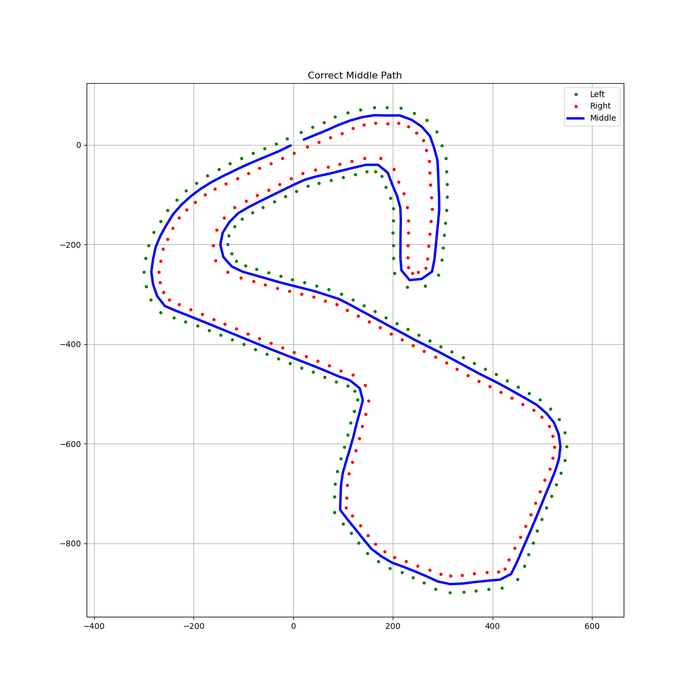

# ROS2 Data Processing Pipeline: Middle Path Calculation

This project establishes a data processing pipeline using Docker and ROS 2 Jazzy.
The system simulates an autonomous vehicle perception task where raw track data is read, transmitted, and processed to calculate the optimal driving path (middle path).

The architecture consists of two isolated containers running on Ubuntu 24.04:
1.  **Data Publisher:** Reads track coordinates from a CSV file and publishes them to a ROS topic.
2.  **Data Processor:** Subscribes to the data, buffers the points, calculates the track's centerline, and visualizes the result.

---

##  Tech Stack
* **OS:** Ubuntu 24.04 (Noble Numbat)
* **Middleware:** ROS 2 Jazzy Jalisco
* **Language:** Python 3.12
* **Containerization:** Docker & Docker Compose
* **Libraries:** `rclpy`, `pandas`, `matplotlib`

---

## Dataset Properties
The project uses the BrandsHatchLayout.csv dataset.

**Statistics:**
* **Total Data Points:** 312 points (156 Left, 156 Right).
* **Structure:** `x`, `y`, `side` (left/right).
---

## Architecture & Pipeline

The system is composed of two main ROS nodes:

### 1. `csv_reader_node` (Publisher)
**Function:** Reads the CSV file line-by-line.
* **Topic:** Publishes `geometry_msgs/Point` messages to `cone_locations`.
* **Logic:**
    * Reads X, Y coordinates.
    * Encodes the **side** information into the `z` coordinate:
        * `z = 1.0` -> Left Boundary
        * `z = 2.0` -> Right Boundary


### 2. `csv_processor_node` (Subscriber)
* **Function:** Listens to `/racing/track_data`.
* **Logic:**
    1.  Collects a batch of points
    2.  Computes the middle path
    3.  Generates a visualization plot.
* **Output:** Saves the result as a PNG file.

---

## How to Run

### Prerequisites
* Docker installed.
* Docker Compose installed.

### Steps to Reproduce
1.  **Clone the repository:**
    Open your terminal and run:
    ```bash
    git clone [https://github.com/YaliB125/bguracing-home_assignment.git](https://github.com/YaliB125/bguracing-home_assignment.git)
    cd bguracing-home_assignment
    ```

2.  **Build and Run (using Docker Compose):**
    This command will build the image and start the container.
    ```bash
    docker compose up --build
    ```

3.  **View Results:**
    Once the process finishes, the result images/data will be saved in the `./data` folder
    
    * *Look for files named:* `result.png`

Results

Below is an example of the calculated middle path generated by the system:


